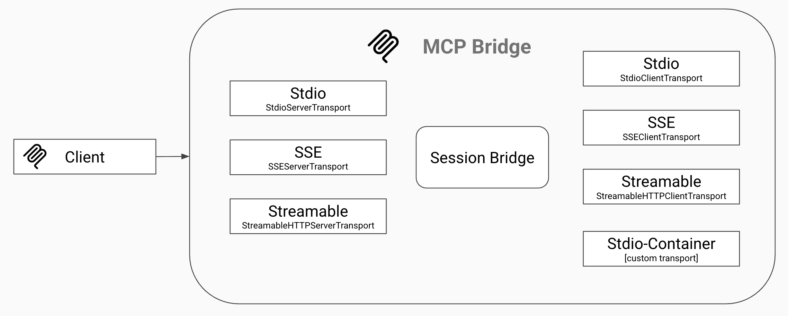

# MCP Bridge

MCP Bridge allows you to present any MCP server endpoint (stdio, sse, or streamable), and bridge it to any other server endpoint (stdio, sse, streamable, or a container).

When the target MCP server is stdio-container, an ephemeral Docker container will be spun up per MCP session and removed at the end of the session.



## Development

This project uses Node.js and the Commander package for CLI functionality.

### Prerequisites

- Node.js (v14 or higher)
- npm

## Installation

### Local Installation

```bash
# Clone the repository
git clone https://github.com/yourusername/mcp-bridge.git
cd mcp-bridge

# Install dependencies
npm install
```

### Global Installation

To use MCP Bridge from anywhere in your system:

```bash
npm install -g .
```

### Running Without Installation

You can also run MCP Bridge directly without installing:

```bash
# Using npm
npm start -- [options]

# Or using node directly
node src/index.js -- [options]
```

## Usage

```bash
mcpbridge [options]
```

### Options

| Option | Description | Default |
|--------|-------------|---------|
| `--serverMode <mode>` | Server mode (sse, stdio, streamable) | "stdio" |
| `--clientMode <mode>` | Client mode (stdio, sse, streamable, stdio-container) | "stdio-container" |
| `--port <number>` | Server port | "3000" |
| `--host <string>` | Server host | "localhost" |
| `--image <string>` | Client container image | - |
| `--endpoint <string>` | Client endpoint | - |
| `--command <string>` | Client command | - |
| `--env <value>` | Environment variable (key=value) | [] |
| `--volume <value>` | Volume mapping | [] |
| `-h, --help` | Display help for command | - |

### Examples

```bash
# Run with stdio server and container client
mcpbridge --serverMode=stdio --clientMode=stdio-container --image=mcp/fetch

# Run with default server mode and container client
mcpbridge --image=mcp/fetch

# Run with SSE server on custom port
mcpbridge --serverMode=sse --port=8080 --image=mcp/fetch

# Run with streamable server and stdio client
mcpbridge --serverMode=streamable --clientMode=stdio --command=npx mcp-fetch
```

## License

MIT